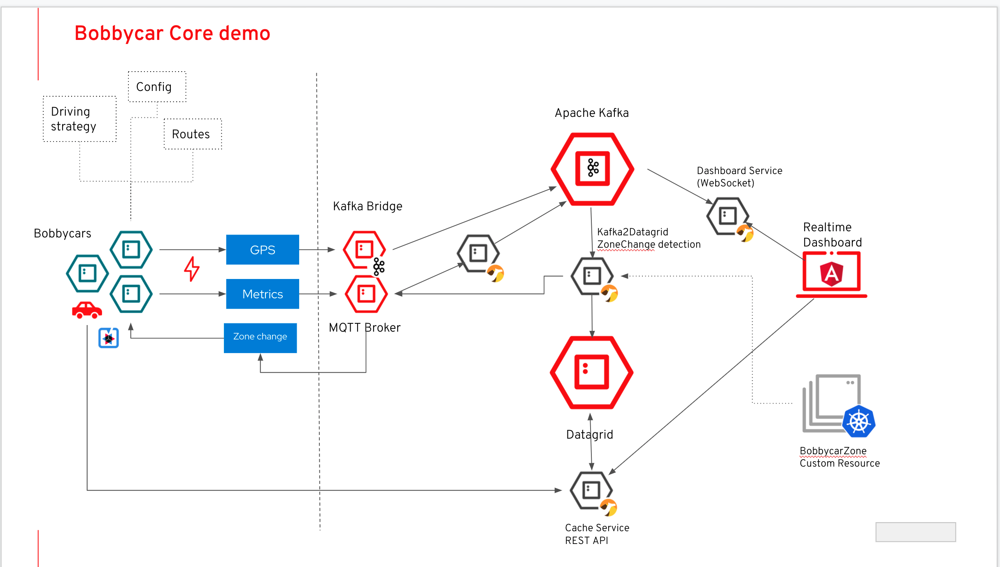

# Opinionated Cloud-native IoT platform
Now let us have a look on how an IoT solution or a subset of it could actually look like? We will explore that in more detail using an exemplary demo implementation called Bobbycar.

Bobbycar is a distributed cloud-native application that implements key aspects of a modern IoT architecture in an exemplary manner. This demo is based on Red Hat’s Kubernetes Distribution, Red Hat OpenShift Container Platform, and uses various middleware components optimized for a cloud-native usage. 

From a technical point of view, there are two core concepts: Bobbycars and Bobbycar zones. 

**Bobbycars:**

Bobbycars are vehicle simulators implemented in Quarkus (cloud-native Java stack) that simulate vehicles (connected cars) and send telemetry data to a regional IoT cloud backend. In this demo they represent the vehicle edge.

**Bobbycar Zone:**

A Bobbycar Zone represents a location based configuration, e.g. an environmental zone, for which a maximum CO2 emission has been defined. Or a listing of various mobility services that are made available at this location. The Bobbycar zones are implemented as Kubernetes Custom Resource.   

For each simulated vehicle, a route is selected at random from a pool of routes at the beginning. Driving this route from start to end is simulated and the current position as well as current telemetry data such as speed, RPM, CO2 emissions … are sent to a regional IoT cloud backend infrastructure. This is done by streaming all sensor data from the vehicles via MQTT to local Kafka clusters. 

